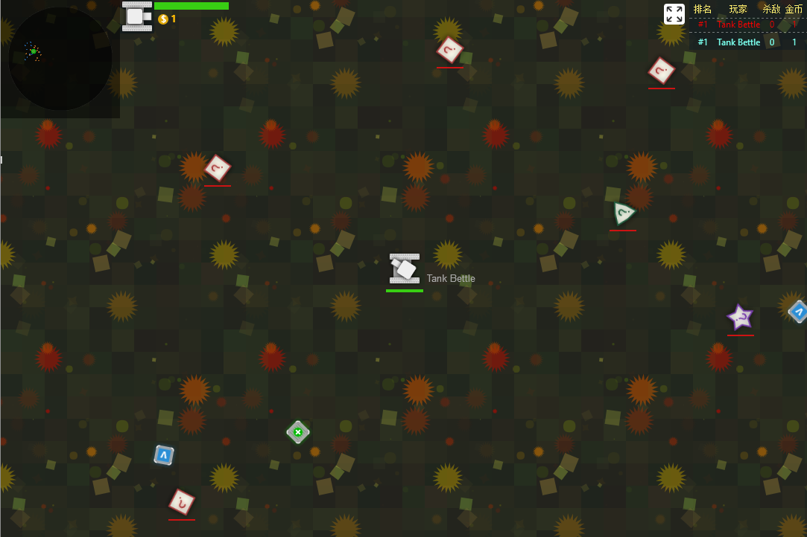

# tank-battle
一个用nodejs写的坦克大战，基于pixijs,websocket等框架

脑袋里最开始的想法是美好的，是想把它做成像slither.io diep.io那样有名的游戏，只可惜经验能力有限走了不少的弯路。
自学自研花了几个月，写了一个版本，这就是那个版本。我从中学到很多东西，同时也探觉了它很多的不足。下面写一点我的心得：

* 用nodejs来写游戏的服务器，最鸡肋的还是它的性能。像子弹轨迹，玩家的位置，等都是在服务器端运算的，同时nodejs又是单线程的。于是问题来了，如果把websocket通信，服务端裁判部分，服务端碰撞检测全都置于一个线程中，用户稍微一多，不得卡死？
于是我拆分了模块，在wsserver目录下，main.js是websocket服务的主服务，referee.js是裁判端。
我用nodejs中的children_process.fork来启动子进程，不过这中间最麻烦的是进程间的通信。因为nodejs的进程间是不能共享内存的。这里边的坑不说了，有兴趣可以看一看代码自己体会。

再讲几点

* 游戏服务器性能方面，测试时大概容纳150个玩家流畅的同时游戏

* 碰撞检测用的最简单的办法，未使用四叉树和包围盒算法。动态规划处理消息的收发，减少服务器的负载，详情参见`wsserver/main.js` 的源码


## screenshot:

>demo 1:<br>


## start:

先获取项目
```cmd
$ npm install
```
安装完node依赖
```cmd
// 启动websocket服务
$ npm run ws

// 启动web服务
$ npm run web
```
运行服务器


浏览器打开 
<a href="http://localhost:5000/" target="_blank">http://localhost:5000/</a>


试玩之后，如果给我一颗star，不胜感激
<a href="https://github.com/yqsailor/tank-battle" target="_blank">https://github.com/yqsailor/tank-battle</a>
